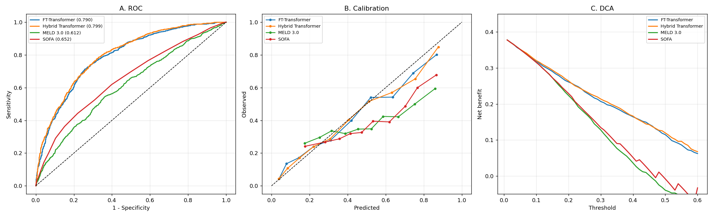

# Transformer risk models for acute liver failure (MIMIC-IV)

Reference implementation of two Transformer architectures for in-hospital
mortality prediction in patients admitted to the intensive care unit with acute
liver failure, together with a common statistical evaluation framework
(discrimination, calibration, decision curves, non-linearity, reproducibility).

The code accompanies an analysis of the MIMIC-IV database. **No patient data is
included in this repository** ‚Ä?MIMIC-IV is distributed under a credentialed
data use agreement (see [`docs/DATA.md`](docs/DATA.md)).

---

## Key results

Cohort: 2,508 ICU stays, 963 in-hospital deaths (38.4%).
Out-of-fold predictions from 5-fold cross-validation, averaged over three random
seeds. Intervals are 95% bootstrap CIs.

| Model | AUC (95% CI) | Spearman ρ | HL χ² (P) | ICC across seeds |
|---|---|---|---|---|
| MELD 3.0 | 0.612 (0.590‚Ä?.634) | 0.189 | 390.3 (<0.001) | ‚Ä?|
| SOFA | 0.652 (0.629‚Ä?.672) | 0.256 | 278.2 (<0.001) | ‚Ä?|
| FT-Transformer | 0.790 (0.773‚Ä?.807) | 0.488 | 38.4 (<0.001) | 0.834 |
| **Hybrid Transformer** | **0.799 (0.781‚Ä?.815)** | **0.503** | 23.9 (0.002) | 0.829 |

Both Transformers clearly outperform the conventional severity scores
(DeLong *P* < 0.001 for every comparison). Two findings are worth emphasising:

1. **The Transformers do not beat classical machine learning on this dataset.**
   Single-seed AUCs were 0.776‚Ä?.787, whereas a support vector machine and a
   random forest on the same features reached 0.799 and 0.798. Only after
   averaging three seeds (a cheap ensemble) do the Transformers reach parity.
   With ~2,500 rows and ~35 features the model class is not the bottleneck.
2. **The Transformers are the least reproducible models tested.** ICC across
   random seeds was ‚â?.83, against 0.93 for a forward-Wald logistic model across
   half-sample refits and ‚â?.99 for conventional scores across multiply imputed
   datasets.



---

## Architectures

| Class | Description |
|---|---|
| `FTTransformer` | Feature Tokenizer + Transformer ([Gorishniy et al., NeurIPS 2021](https://arxiv.org/abs/2106.11959)). Every numerical feature gets its own projection vector, every binary feature its own bias vector; a learnable `[CLS]` token aggregates the representation. |
| `HybridTransformer` | `FTTransformer` plus one token per follow-up day. Each day token concatenates the standardised laboratory values of that day with a per-value missingness indicator, so irregular sampling is modelled instead of discarding patients. |

Default configuration: `d_model=48`, 4 attention heads, 2 encoder layers,
feed-forward width 128, dropout 0.15, AdamW with cosine annealing, gradient
clipping at 5.0, early stopping with patience 12. Both models have ‚â?8k
parameters.

---

## Installation

```bash
conda env create -f environment.yml
conda activate alf-transformer
pip install -e .
```

or, with an existing environment:

```bash
pip install -r requirements.txt
pip install -e .
```

PyTorch CPU wheels are sufficient; training the full cross-validation for both
architectures and three seeds takes roughly 25 minutes on 12 CPU cores.

---

## Data

This repository does **not** ship data. To reproduce the analysis you need:

1. **MIMIC-IV v2.2** ‚Ä?request access via [PhysioNet](https://physionet.org/content/mimiciv/)
   and complete the required training. The data use agreement prohibits
   redistribution.
2. Run the preparation scripts in order:

```bash
python scripts/01_build_cohort.py     # cohort + trajectory panel from MIMIC-IV CSVs
Rscript scripts/02_impute.R           # multiple imputation (MICE-PMM, m = 20)
python scripts/03_train.py            # train the Transformers, write OOF predictions
python scripts/04_evaluate.py         # statistics, tables and figures
```

See [`docs/DATA.md`](docs/DATA.md) for the expected file layout and column names.

---

## Quick start

```python
from alf_transformer import DataSpec, load_dataset, run_seeds, evaluate_models

spec = DataSpec(outcome="outcome")
ds = load_dataset("data/cohort.csv", "data/trajectory_panel.csv", spec)

oof, seed_matrix = run_seeds(ds, arch="hybrid", seeds=(42, 7, 2024))

results = evaluate_models({"Hybrid Transformer": oof}, ds.y)
print(results["auc"])
```

---

## Repository layout

```
.
├── src/alf_transformer/
‚î?  ‚îú‚îÄ‚îÄ data.py         cohort assembly, trajectory panel, standardisation
‚î?  ‚îú‚îÄ‚îÄ models.py       FT-Transformer and Hybrid Transformer
‚î?  ‚îú‚îÄ‚îÄ train.py        cross-validation with inner-split early stopping
‚î?  ‚îú‚îÄ‚îÄ evaluate.py     evaluation orchestration
‚î?  ‚îî‚îÄ‚îÄ stats.py        RCS, DeLong, Hosmer-Lemeshow, DCA, ICC, RM-ANOVA
├── scripts/            end-to-end pipeline (cohort -> imputation -> model -> stats)
├── tests/              unit tests for the statistical routines
├── docs/
‚î?  ‚îú‚îÄ‚îÄ DATA.md         obtaining MIMIC-IV and preparing the inputs
‚î?  ‚îú‚îÄ‚îÄ METHODS.md      modelling and statistical detail
‚î?  ‚îî‚îÄ‚îÄ RESULTS.md      full result tables
├── configs/default.yaml
├── environment.yml
└── requirements.txt
```

---

## Methodological notes

Two issues were found while developing this code and are worth flagging, because
both are easy to reproduce and both inflate apparent performance.

### Early stopping must not use the evaluation fold

Selecting the best epoch on the same fold used to report performance produced
**AUC 0.851 instead of 0.779** for the FT-Transformer and **0.848 instead of
0.783** for the Hybrid Transformer ‚Ä?an inflation of 0.06‚Ä?.07 AUC. The
implementation here carves a 15% inner validation split out of the training fold
and never touches the outer fold during training.

### Derived scores must not be used to impute their own components

The MELD score in MIMIC-IV is derived from bilirubin, INR and creatinine, with
missing components substituted by 1. Using MELD as a predictor when imputing
those same components propagates the substitution and biases the imputed values
downward (observed bilirubin 6.49 vs imputed 1.59 mg/dL before the fix). MELD is
therefore excluded from the imputation model. See [`docs/METHODS.md`](docs/METHODS.md).

---

## Limitations

* Single-centre retrospective cohort (Beth Israel Deaconess Medical Center,
  2008‚Ä?019); external validation is required.
* The cohort is defined by a broad set of liver-failure ICD codes and therefore
  mixes acute liver failure, acute-on-chronic liver failure and unspecified
  hepatic failure.
* Hepatic encephalopathy grade ‚Ä?a component of the formal acute liver failure
  definition ‚Ä?is not recorded in MIMIC-IV and could not be modelled.
* Predictions are not calibrated out of the box; the reported models require
  recalibration before any clinical use.

---

## Citation

```bibtex
@software{alf_transformer_mimic,
  title  = {Transformer risk models for acute liver failure on MIMIC-IV},
  year   = {2026},
  note   = {Reference implementation},
  url    = {https://github.com/wuwr5/alf-transformer-mimic}
}
```

If you use MIMIC-IV, cite the original data descriptor as well:

> Johnson AEW, Bulgarelli L, Shen L, et al. MIMIC-IV, a freely accessible
> electronic health record dataset. *Sci Data*. 2023;10:1.

---

## License

Code released under the MIT License ‚Ä?see [`LICENSE`](LICENSE).
MIMIC-IV itself is governed by the PhysioNet credentialed data use agreement and
is not covered by this licence.
